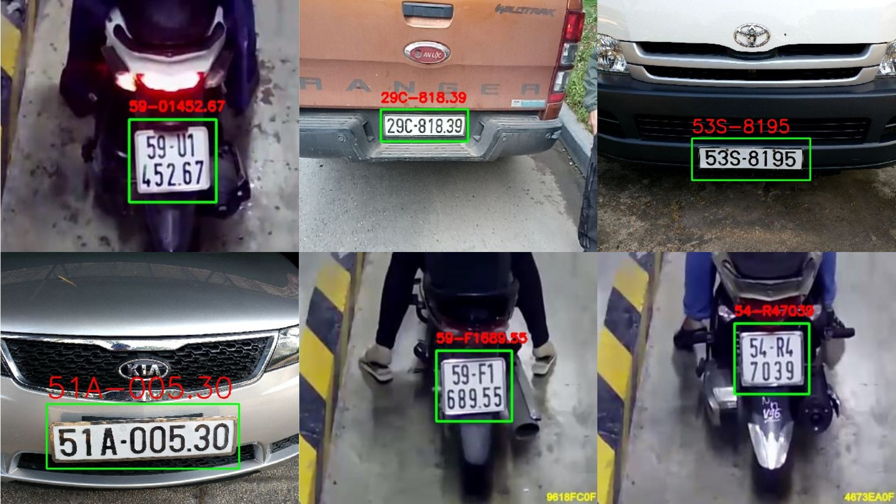
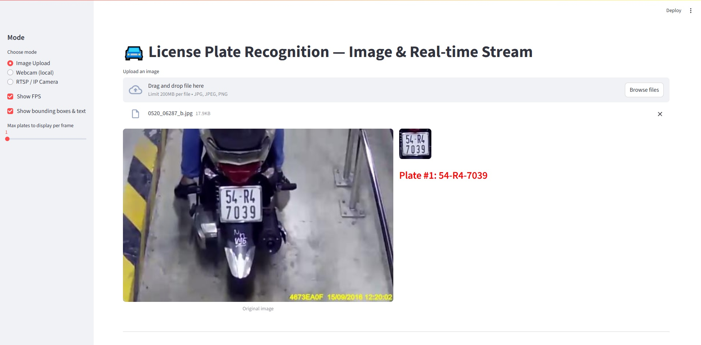

# 🚘 License Plate Recognition (YOLOv8 + vLLM Qwen2-VL Fine-tuning)

## 📌 Giới thiệu
Dự án này gồm 3 phần:
1. **Huấn luyện mô hình YOLOv8** để phát hiện vị trí biển số xe (ô tô, xe máy) trong mọi điều kiện ánh sáng, thời tiết, kể cả ảnh mờ hoặc bẩn.
2. **Huấn luyện (Fine-tune) mô hình vLLM (image_to_text)** dựa trên `unsloth/Qwen2-VL-2B-Instruct-bnb-4bit` để trích xuất thông tin biển số xe một cách chính xác.
3. **Ứng dụng Streamlit** tích hợp mô hình YOLOv8 và mô hình vLLM đã fine-tune để trích xuất nội dung biển số theo thời gian thực hoặc từ ảnh tải lên.

---

## 📊 Kết quả


---

## 💻 Demo trên Streamlit
### Lưu ý:
- Lần chạy với ảnh đầu tiên sẽ chậm vì cần load các mô hình và từ các lần sau tốc độ xử lý rất nhanh!


---


## 🏗️ Cấu trúc dự án

```
├── files_model/
│ ├── license_plate_detector_yolov8.pt                          # Mô hình YOLOv8 detect biển số
│ └── unsloth_finetune/                                         # Mô hình vLLM đã fine-tune
├── requirements.txt                                            # Các thư viện cần cài đặt
├── finetune_qwen2_vl_2b_instruct_bnb_4bit_ocr_biensoxe.py      # Script fine-tune mô hình vLLM
├── main.py                                                     # Mã chính để chạy chương trình
```
---

## 📚 Cài đặt thư viện
```
pip install -r requirements.txt
```

## ⚙️ 1. Huấn luyện mô hình YOLOv8

### 📂 Dữ liệu huấn luyện
Dự án sử dụng kết hợp hai bộ dữ liệu chất lượng cao:
- [Bộ ảnh biển số xe máy – GreenParking](https://github.com/thigiacmaytinh/DataThiGiacMayTinh/blob/main/GreenParking.zip)  
  Gồm nhiều góc chụp, điều kiện ánh sáng khác nhau, phù hợp cho nhận diện biển số xe máy.
- [Bộ ảnh biển số ô tô](https://drive.google.com/file/d/1U5ebTzW2c_sVVTCSX1QH-ZJFpLijMdUv/view)  
  Bao gồm đầy đủ các loại biển xe ô tô: biển dài, biển vuông, và biển vàng.

### 🔧 Quy trình huấn luyện
1. **Tiền xử lý & gán nhãn dữ liệu**  
   - Đánh nhãn tọa độ *bounding box* chính xác vị trí biển số trên từng ảnh.
2. **Tổ chức cấu trúc dữ liệu**  
   - Sắp xếp và định dạng thư mục theo chuẩn YOLOv8 (`data.yaml`, thư mục `images/` và `labels/`).
3. **Tiến hành huấn luyện**  
   - Sử dụng lệnh sau để bắt đầu huấn luyện mô hình:
   ```bash
   yolo detect train data=data.yaml model=yolov8.pt epochs=100 imgsz=640
   ```

---

## ⚙️ 2. Fine-tune mô hình vLLM

### Dataset
- Sử dụng bộ dữ liệu: [EZCon/taiwan-license-plate-recognition](https://huggingface.co/datasets/EZCon/taiwan-license-plate-recognition)
- Chỉ giữ lại 2 trường: `image` và `text` (biển số thực tế).

### Cấu hình huấn luyện
- **Base model:** `unsloth/Qwen2-VL-2B-Instruct-bnb-4bit`
- **Kỹ thuật:** LoRA fine-tuning (tối ưu cả layer vision + language).
- **Số bước huấn luyện:** 50 (`MAX_STEPS`)
- **Instruction:** Mô tả chi tiết yêu cầu OCR để mô hình trả về kết quả chính xác, không lẫn ký tự.

### Chạy huấn luyện
```bash
python finetune_qwen2_vl_2b_instruct_bnb_4bit_ocr_biensoxe.py
```

- Sau khi chạy xong, mô hình đã fine-tune sẽ được lưu tại: `files_model/unsloth_finetune/`


---

## ⚙️ 3. Ứng dụng Streamlit nhận diện biển số
### Tính năng
- 📷 Nhận diện từ ảnh tải lên: Người dùng chọn file ảnh (jpg, jpeg, png), hệ thống sẽ phát hiện và đọc biển số.

- 🎥 Nhận diện real-time:

    - Webcam máy tính.

    - Camera IP / RTSP.

- ✨ Hiển thị FPS, vẽ bounding box và biển số lên video.

### Cách chạy ứng dụng

```bash
streamlit run main.py
```

### Cấu hình trong giao diện
- Mode: Chọn giữa Image Upload, Webcam (local), hoặc RTSP / IP Camera.

- Show FPS: Bật/tắt hiển thị tốc độ khung hình.

- Show bounding boxes: Hiển thị khung và text trên video.

- Max plates per frame: Giới hạn số lượng biển số xử lý mỗi frame.

---

## 📦 Yêu cầu hệ thống
- **Python** >= 3.9  
- **GPU có CUDA** *(khuyến nghị để chạy nhanh hơn)*

---

## ⚠️ Nhược điểm hiện tại
- Chưa bao quát được tất cả điều kiện thực tế, ví dụ: biển số bị che khuất một phần, bị bẩn hoặc mờ do chuyển động.

- Mô hình có thể giảm độ chính xác với ảnh chụp từ khoảng cách xa hoặc khi biển số bị biến dạng.

- Tốc độ xử lý có thể chậm trên thiết bị không có GPU hoặc GPU yếu.

- Chưa tối ưu cho môi trường nhiều biển số xuất hiện đồng thời.

- Chưa tích hợp bước lọc kết quả nhận dạng để loại bỏ các dự đoán sai hoặc trùng lặp.

## 🚀 Hướng cải tiến trong tương lai
- Mở rộng bộ dữ liệu với nhiều điều kiện thời tiết, môi trường và góc chụp đa dạng hơn.

- Data augmentation nâng cao: thêm nhiễu, làm mờ chuyển động, điều chỉnh độ sáng/tương phản để tăng khả năng khái quát của mô hình.

- Sử dụng tối ưu mô hình detect biển số tốt hơn YOLOv8 đang được sử dụng trong dự án.

- Chọn và fine-tune mô hình vLLM tốt hơn, tối ưu hơn.

---

## 📞 Liên hệ
Mọi thắc mắc xin vui lòng liên hệ qua email: nguyenphuongv07@gmail.com.
